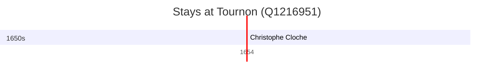

# Tournon (Q1216951)

*commune in Savoie, France*

Wikidata: [Q1216951](https://www.wikidata.org/wiki/Q1216951)

1 occurrence(s) across 1 transcribed value(s), 1 person(s).

**Transcribed variants:**

- `Tournon` (1×, 1654–1654)

| Date | Variant | Person | Type | Entity id | Real entity |
|------|---------|--------|------|-----------|-------------|
| 1654-05-31 | Tournon | Christophe Cloche | jesuita-votos-local | [deh-christophe-cloche](deh-christophe-cloche) | — |

