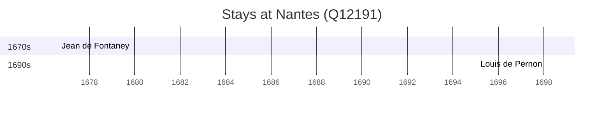

# Nantes (Q12191)

*city in Loire-Atlantique, Pays de la Loire, France*

Wikidata: [Q12191](https://www.wikidata.org/wiki/Q12191)

2 occurrence(s) across 2 transcribed value(s), 2 person(s).

**Transcribed variants:**

- `Nantes (residência)` (1×, 1676–1676)
- `Nantes` (1×, 1698–1698)

| Date | Variant | Person | Type | Entity id | Real entity |
|------|---------|--------|------|-----------|-------------|
| 1676-08-15 | Nantes (residência) | Jean de Fontaney | jesuita-votos-local | [deh-jean-de-fontaney](deh-jean-de-fontaney) | — |
| 1698-02-02 | Nantes | Louis de Pernon | jesuita-votos-local | [deh-louis-de-pernon](deh-louis-de-pernon) | — |

