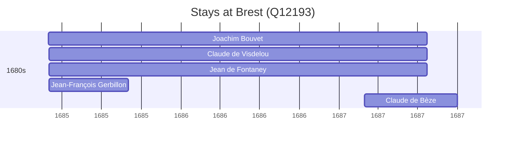

# Brest (Q12193)

*port city in the Finistère department, Brittany, France*

Wikidata: [Q12193](https://www.wikidata.org/wiki/Q12193)

5 occurrence(s) across 1 transcribed value(s), 5 person(s).

**Transcribed variants:**

- `Brest` (5×, 1685–1687)

| Date | Variant | Person | Type | Entity id | Real entity |
|------|---------|--------|------|-----------|-------------|
| 1685-03 | Brest | Joachim Bouvet | estadia | [deh-joachim-bouvet](deh-joachim-bouvet) | [rp407623](rp407623) |
| 1685-03-03 | Brest | Claude de Visdelou | estadia | [deh-claude-de-visdelou](deh-claude-de-visdelou) | — |
| 1685-03-03 | Brest | Jean de Fontaney | estadia | [deh-jean-de-fontaney](deh-jean-de-fontaney) | — |
| 1685-03-03 | Brest | Jean-François Gerbillon | estadia | [deh-jean-francois-gerbillon](deh-jean-francois-gerbillon) | — |
| 1687-03-01 | Brest | Claude de Bèze | estadia | [deh-claude-de-beze](deh-claude-de-beze) | — |

### Co-presence

These persons were plausibly at this place during overlapping periods (interval estimation from stay dates; rough — see method note below).

| Period | Persons |
|--------|---------|
| 1680s | [Claude de Bèze](deh-claude-de-beze), [Claude de Visdelou](deh-claude-de-visdelou), [Jean de Fontaney](deh-jean-de-fontaney), [Jean-François Gerbillon](deh-jean-francois-gerbillon), [Joachim Bouvet](rp407623) |

*9 overlapping pair(s) involving 5 person(s). Method: interval start = stay event date; end = next embarque/partida/different-place event, or death, or +15yr cap.*

