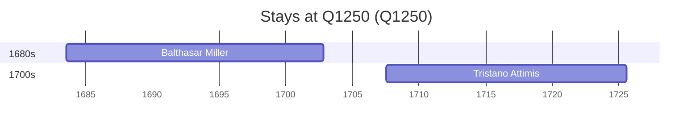

# Q1250

*(fetch error: HTTP Error 429: Too Many Requests)*

Wikidata: [Q1250](https://www.wikidata.org/wiki/Q1250)

2 occurrence(s) across 2 transcribed value(s), 2 person(s).

**Transcribed variants:**

- `Friuli` (1×, 1683–1683)
- `Frioul (no palácio dos condes d'Attimis)` (1×, 1707–1707)

| Date | Variant | Person | Type | Entity id | Real entity |
|------|---------|--------|------|-----------|-------------|
| 1683-07-17 | Friuli | Balthasar Miller | nascimento | [deh-balthasar-miller](deh-balthasar-miller) | — |
| 1707-07-28 | Frioul (no palácio dos condes d'Attimis) | Tristano Attimis | nascimento | [deh-tristano-attimis](deh-tristano-attimis) | — |

