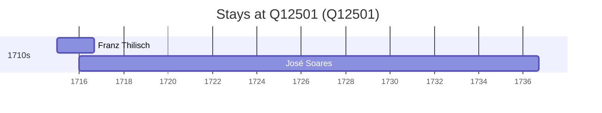

# Q12501

*(fetch error: HTTP Error 429: Too Many Requests)*

Wikidata: [Q12501](https://www.wikidata.org/wiki/Q12501)

3 occurrence(s) across 1 transcribed value(s), 3 person(s).

**Transcribed variants:**

- `Grande Muralha da China` (3×, 1715–1716)

| Date | Variant | Person | Type | Entity id | Real entity |
|------|---------|--------|------|-----------|-------------|
| — | Grande Muralha da China | Martino Martini | estadia | [deh-martino-martini](deh-martino-martini) | — |
| 1715 | Grande Muralha da China | Franz Thilisch | estadia | [deh-franz-thilisch](deh-franz-thilisch) | — |
| 1716 | Grande Muralha da China | José Soares | estadia | [deh-jose-soares](deh-jose-soares) | — |

### Co-presence

These persons were plausibly at this place during overlapping periods (interval estimation from stay dates; rough — see method note below).

| Period | Persons |
|--------|---------|
| 1710s | [Franz Thilisch](deh-franz-thilisch), [José Soares](deh-jose-soares) |

*1 overlapping pair(s) involving 2 person(s). Method: interval start = stay event date; end = next embarque/partida/different-place event, or death, or +15yr cap.*

