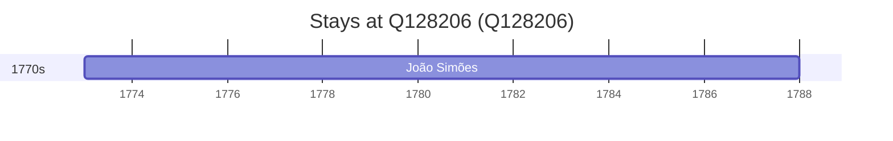

# Q128206

*(fetch error: HTTP Error 429: Too Many Requests)*

Wikidata: [Q128206](https://www.wikidata.org/wiki/Q128206)

1 occurrence(s) across 1 transcribed value(s), 1 person(s).

**Transcribed variants:**

- `Sezze, Itália` (1×, 1773–1773)

| Date | Variant | Person | Type | Entity id | Real entity |
|------|---------|--------|------|-----------|-------------|
| 1773 | Sezze, Itália | João Simões | estadia | [deh-joao-simoes](deh-joao-simoes) | — |

