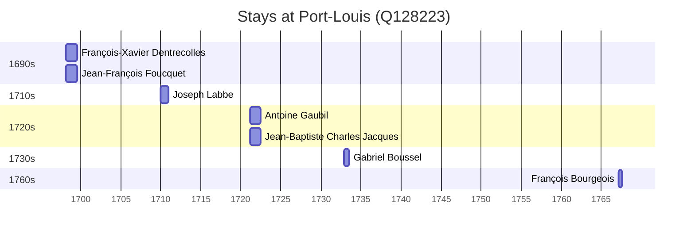

# Port-Louis (Q128223)

*commune in Morbihan, France*

Wikidata: [Q128223](https://www.wikidata.org/wiki/Q128223)

7 occurrence(s) across 1 transcribed value(s), 7 person(s).

**Transcribed variants:**

- `Port-Louis` (7×, 1698–1767)

| Date | Variant | Person | Type | Entity id | Real entity |
|------|---------|--------|------|-----------|-------------|
| 1698-02-21 | Port-Louis | François-Xavier Dentrecolles | estadia | [deh-francois-xavier-dentrecolles](deh-francois-xavier-dentrecolles) | — |
| 1698-02-21 | Port-Louis | Jean-François Foucquet | estadia | [deh-jean-francois-foucquet](deh-jean-francois-foucquet) | — |
| 1710 | Port-Louis | Joseph Labbe | estadia | [deh-joseph-labbe](deh-joseph-labbe) | — |
| 1721-03-07 | Port-Louis | Antoine Gaubil | estadia | [deh-antoine-gaubil](deh-antoine-gaubil) | — |
| 1721-03-07 | Port-Louis | Jean-Baptiste Charles Jacques | estadia | [deh-jean-baptiste-charles-jacques](deh-jean-baptiste-charles-jacques) | — |
| 1732-11-10 | Port-Louis | Gabriel Boussel | estadia | [deh-gabriel-boussel](deh-gabriel-boussel) | [rp796803](rp796803) |
| 1767-03-15 | Port-Louis | François Bourgeois | estadia | [deh-francois-bourgeois](deh-francois-bourgeois) | — |

### Co-presence

These persons were plausibly at this place during overlapping periods (interval estimation from stay dates; rough — see method note below).

| Period | Persons |
|--------|---------|
| 1690s | [François-Xavier Dentrecolles](deh-francois-xavier-dentrecolles), [Jean-François Foucquet](deh-jean-francois-foucquet) |
| 1720s | [Antoine Gaubil](deh-antoine-gaubil), [Jean-Baptiste Charles Jacques](deh-jean-baptiste-charles-jacques) |

*2 overlapping pair(s) involving 4 person(s). Method: interval start = stay event date; end = next embarque/partida/different-place event, or death, or +15yr cap.*

