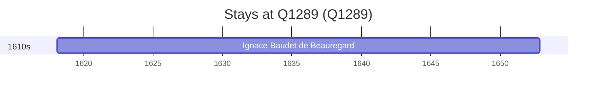

# Q1289

*(fetch error: HTTP Error 429: Too Many Requests)*

Wikidata: [Q1289](https://www.wikidata.org/wiki/Q1289)

1 occurrence(s) across 1 transcribed value(s), 1 person(s).

**Transcribed variants:**

- `St-Hugues-St-Jean de Grenoble` (1×, 1618–1618)

| Date | Variant | Person | Type | Entity id | Real entity |
|------|---------|--------|------|-----------|-------------|
| 1618-02-07 | St-Hugues-St-Jean de Grenoble | Ignace Baudet de Beauregard | nascimento | [deh-ignace-baudet-de-beauregard](deh-ignace-baudet-de-beauregard) | — |

