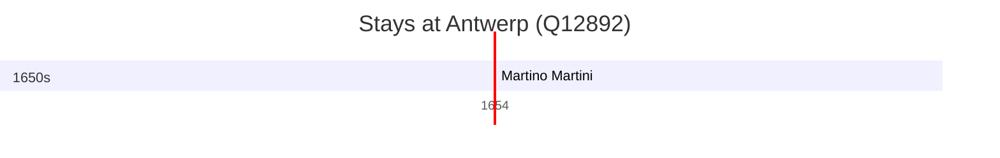

# Antwerp (Q12892)

*municipality in the province of Antwerp, Belgium*

Wikidata: [Q12892](https://www.wikidata.org/wiki/Q12892)

2 occurrence(s) across 1 transcribed value(s), 2 person(s).

**Transcribed variants:**

- `Antuérpia` (2×, 1654–1722)

| Date | Variant | Person | Type | Entity id | Real entity |
|------|---------|--------|------|-----------|-------------|
| 1654 | Antuérpia | Martino Martini | estadia | [deh-martino-martini](deh-martino-martini) | — |
| 1722-01-06 | Antuérpia | Gerard Arnould Rijckewaert | morte | [deh-gerard-arnould-rijckewaert](deh-gerard-arnould-rijckewaert) | — |

