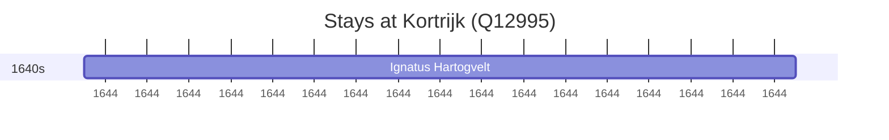

# Kortrijk (Q12995)

*municipality in West Flanders, Belgium*

Wikidata: [Q12995](https://www.wikidata.org/wiki/Q12995)

1 occurrence(s) across 1 transcribed value(s), 1 person(s).

**Transcribed variants:**

- `Courtrai` (1×, 1644–1644)

| Date | Variant | Person | Type | Entity id | Real entity |
|------|---------|--------|------|-----------|-------------|
| 1644-09-26 | Courtrai | Ignatus Hartogvelt | jesuita-entrada | [deh-ignatus-hartogvelt](deh-ignatus-hartogvelt) | — |

