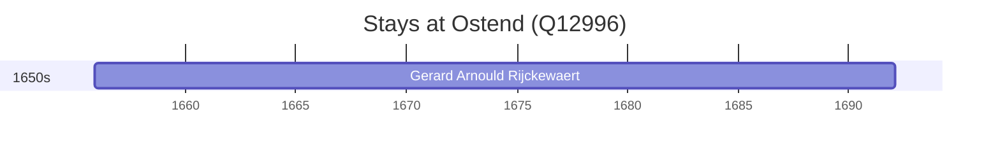

# Ostend (Q12996)

*coastal city in West Flanders, Belgium*

Wikidata: [Q12996](https://www.wikidata.org/wiki/Q12996)

1 occurrence(s) across 1 transcribed value(s), 1 person(s).

**Transcribed variants:**

- `Ostend, Bélgica` (1×, 1655–1655)

| Date | Variant | Person | Type | Entity id | Real entity |
|------|---------|--------|------|-----------|-------------|
| 1655-11-28 | Ostend, Bélgica | Gerard Arnould Rijckewaert | nascimento | [deh-gerard-arnould-rijckewaert](deh-gerard-arnould-rijckewaert) | — |

