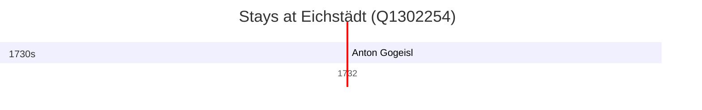

# Eichstädt (Q1302254)

*village in Brandenburg state, Germany*

Wikidata: [Q1302254](https://www.wikidata.org/wiki/Q1302254)

1 occurrence(s) across 1 transcribed value(s), 1 person(s).

**Transcribed variants:**

- `Eichstädt` (1×, 1732–1732)

| Date | Variant | Person | Type | Entity id | Real entity |
|------|---------|--------|------|-----------|-------------|
| 1732-06-07 | Eichstädt | Anton Gogeisl | jesuita-ordenacao-padre | [deh-anton-gogeisl](deh-anton-gogeisl) | — |

