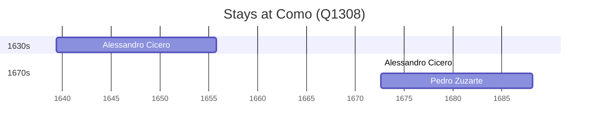

# Como (Q1308)

*Italian city*

Wikidata: [Q1308](https://www.wikidata.org/wiki/Q1308)

3 occurrence(s) across 2 transcribed value(s), 2 person(s).

**Transcribed variants:**

- `Como, Itália` (2×, 1639–1672)
- `Como («in sacrario collegii S. J.»), Itália` (1×, 1672–1672)

| Date | Variant | Person | Type | Entity id | Real entity |
|------|---------|--------|------|-----------|-------------|
| 1639-05-28 | Como, Itália | Alessandro Cicero | nascimento | [deh-alessandro-cicero](deh-alessandro-cicero) | [rp532453](rp532453) |
| 1672-08-15 | Como («in sacrario collegii S. J.»), Itália | Alessandro Cicero | jesuita-votos-local | [deh-alessandro-cicero](deh-alessandro-cicero) | [rp532453](rp532453) |
| 1672-08-15 | Como, Itália | Pedro Zuzarte | estadia | [deh-pedro-zuzarte](deh-pedro-zuzarte) | — |

