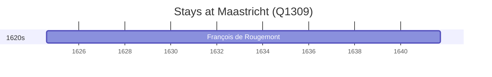

# Maastricht (Q1309)

*city, municipality and capital of province Limburg, the Netherlands*

Wikidata: [Q1309](https://www.wikidata.org/wiki/Q1309)

1 occurrence(s) across 1 transcribed value(s), 1 person(s).

**Transcribed variants:**

- `Maastricht` (1×, 1624–1624)

| Date | Variant | Person | Type | Entity id | Real entity |
|------|---------|--------|------|-----------|-------------|
| 1624-08-02 | Maastricht | François de Rougemont | nascimento | [deh-francois-de-rougemont](deh-francois-de-rougemont) | — |

