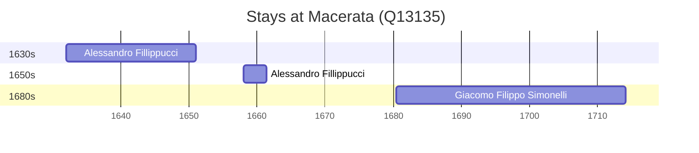

# Macerata (Q13135)

*Italian comune*

Wikidata: [Q13135](https://www.wikidata.org/wiki/Q13135)

4 occurrence(s) across 2 transcribed value(s), 3 person(s).

**Transcribed variants:**

- `Macerata` (3×, 1552–1680)
- `Macerata (colégio)` (1×, 1658–1658)

| Date | Variant | Person | Type | Entity id | Real entity |
|------|---------|--------|------|-----------|-------------|
| 1552-10-06 | Macerata | Matteo Ricci | nascimento | [deh-matteo-ricci](deh-matteo-ricci) | [rp302155](rp302155) |
| 1632-01-05 | Macerata | Alessandro Fillippucci | nascimento | [deh-alessandro-fillippucci](deh-alessandro-fillippucci) | — |
| 1658 | Macerata (colégio) | Alessandro Fillippucci | estadia | [deh-alessandro-fillippucci](deh-alessandro-fillippucci) | — |
| 1680-06-25 | Macerata | Giacomo Filippo Simonelli | nascimento | [deh-giacomo-filippo-simonelli](deh-giacomo-filippo-simonelli) | — |

