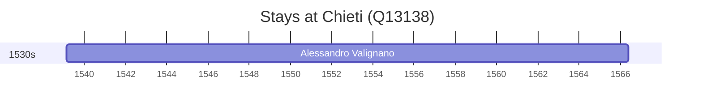

# Chieti (Q13138)

*Italian comune*

Wikidata: [Q13138](https://www.wikidata.org/wiki/Q13138)

1 occurrence(s) across 1 transcribed value(s), 1 person(s).

**Transcribed variants:**

- `Chieti, Abruzzi` (1×, 1539–1539)

| Date | Variant | Person | Type | Entity id | Real entity |
|------|---------|--------|------|-----------|-------------|
| 1539-02-20 | Chieti, Abruzzi | Alessandro Valignano | nascimento | [deh-alessandro-valignano](deh-alessandro-valignano) | — |

