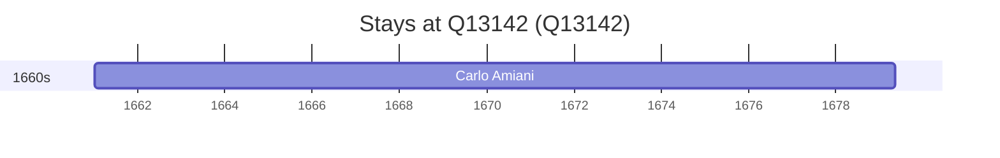

# Q13142

*(fetch error: HTTP Error 429: Too Many Requests)*

Wikidata: [Q13142](https://www.wikidata.org/wiki/Q13142)

1 occurrence(s) across 1 transcribed value(s), 1 person(s).

**Transcribed variants:**

- `Fano, Itália` (1×, 1661–1661)

| Date | Variant | Person | Type | Entity id | Real entity |
|------|---------|--------|------|-----------|-------------|
| 1661-01-06 | Fano, Itália | Carlo Amiani | nascimento | [deh-carlo-amiani](deh-carlo-amiani) | — |

