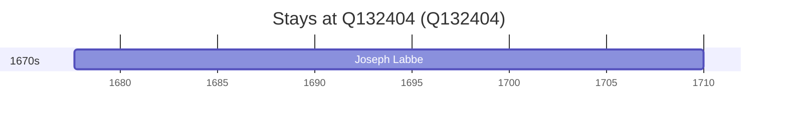

# Q132404

*(fetch error: HTTP Error 429: Too Many Requests)*

Wikidata: [Q132404](https://www.wikidata.org/wiki/Q132404)

2 occurrence(s) across 2 transcribed value(s), 1 person(s).

**Transcribed variants:**

- `Bourges` (1×, 1677–1677)
- `Bourges (paróquia de la Chapelle)` (1×, 1680–1680)

| Date | Variant | Person | Type | Entity id | Real entity |
|------|---------|--------|------|-----------|-------------|
| 1677-08-30 | Bourges | Joseph Labbe | nascimento | [deh-joseph-labbe](deh-joseph-labbe) | — |
| 1680-02-19 | Bourges (paróquia de la Chapelle) | Joseph Labbe | baptizado | [deh-joseph-labbe](deh-joseph-labbe) | — |

