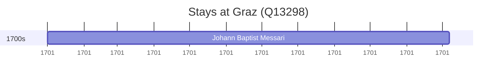

# Graz (Q13298)

*capital of Styria, Austria*

Wikidata: [Q13298](https://www.wikidata.org/wiki/Q13298)

2 occurrence(s) across 1 transcribed value(s), 1 person(s).

**Transcribed variants:**

- `Graz` (2×, 1701–1701)

| Date | Variant | Person | Type | Entity id | Real entity |
|------|---------|--------|------|-----------|-------------|
| 1701 | Graz | Johann Baptist Messari | estadia | [deh-johann-baptist-messari](deh-johann-baptist-messari) | — |
| 1701 | Graz | Johann Baptist Messari | jesuita-ordenacao-padre | [deh-johann-baptist-messari](deh-johann-baptist-messari) | — |

