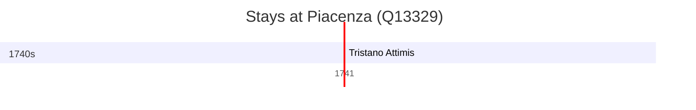

# Piacenza (Q13329)

*Italian comune*

Wikidata: [Q13329](https://www.wikidata.org/wiki/Q13329)

1 occurrence(s) across 1 transcribed value(s), 1 person(s).

**Transcribed variants:**

- `Piacenza` (1×, 1741–1741)

| Date | Variant | Person | Type | Entity id | Real entity |
|------|---------|--------|------|-----------|-------------|
| 1741-02-02 | Piacenza | Tristano Attimis | jesuita-votos-local | [deh-tristano-attimis](deh-tristano-attimis) | — |

