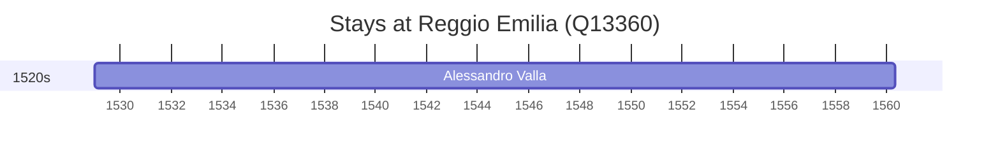

# Reggio Emilia (Q13360)

*Italian commune (comune) in Emilia-Romagna*

Wikidata: [Q13360](https://www.wikidata.org/wiki/Q13360)

1 occurrence(s) across 1 transcribed value(s), 1 person(s).

**Transcribed variants:**

- `Reggio` (1×, 1529–1529)

| Date | Variant | Person | Type | Entity id | Real entity |
|------|---------|--------|------|-----------|-------------|
| 1529 | Reggio | Alessandro Valla | nascimento | [deh-alessandro-valla](deh-alessandro-valla) | — |

