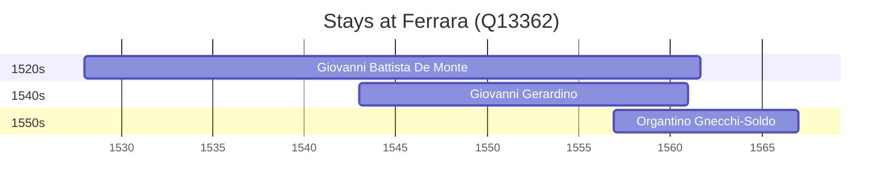

# Ferrara (Q13362)

*comune in Emilia-Romagna, Italy*

Wikidata: [Q13362](https://www.wikidata.org/wiki/Q13362)

4 occurrence(s) across 1 transcribed value(s), 3 person(s).

**Transcribed variants:**

- `Ferrara` (4×, 1528–1556)

| Date | Variant | Person | Type | Entity id | Real entity |
|------|---------|--------|------|-----------|-------------|
| 1528 | Ferrara | Giovanni Battista De Monte | nascimento | [deh-giovanni-battista-de-monte](deh-giovanni-battista-de-monte) | — |
| 1543 | Ferrara | Giovanni Gerardino | nascimento | [deh-giovanni-gerardino](deh-giovanni-gerardino) | — |
| 1555 | Ferrara | Giovanni Battista De Monte | jesuita-entrada | [deh-giovanni-battista-de-monte](deh-giovanni-battista-de-monte) | — |
| 1556-12 | Ferrara | Organtino Gnecchi-Soldo | jesuita-entrada | [deh-organtino-gnecchi-soldo](deh-organtino-gnecchi-soldo) | — |

### Co-presence

These persons were plausibly at this place during overlapping periods (interval estimation from stay dates; rough — see method note below).

| Period | Persons |
|--------|---------|
| 1540s | [Giovanni Battista De Monte](deh-giovanni-battista-de-monte), [Giovanni Gerardino](deh-giovanni-gerardino) |
| 1550s | [Giovanni Battista De Monte](deh-giovanni-battista-de-monte), [Giovanni Gerardino](deh-giovanni-gerardino), [Organtino Gnecchi-Soldo](deh-organtino-gnecchi-soldo) |

*3 overlapping pair(s) involving 3 person(s). Method: interval start = stay event date; end = next embarque/partida/different-place event, or death, or +15yr cap.*

