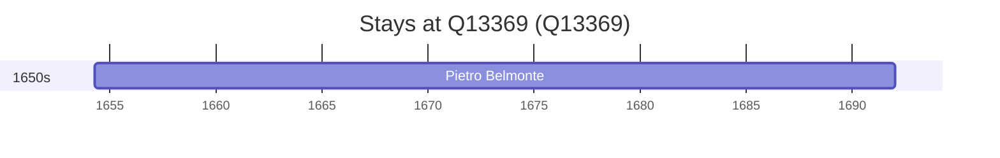

# Q13369

*(fetch error: HTTP Error 429: Too Many Requests)*

Wikidata: [Q13369](https://www.wikidata.org/wiki/Q13369)

1 occurrence(s) across 1 transcribed value(s), 1 person(s).

**Transcribed variants:**

- `Rimini` (1×, 1654–1654)

| Date | Variant | Person | Type | Entity id | Real entity |
|------|---------|--------|------|-----------|-------------|
| 1654-04-10 | Rimini | Pietro Belmonte | nascimento | [deh-pietro-balemonte](deh-pietro-balemonte) | — |

