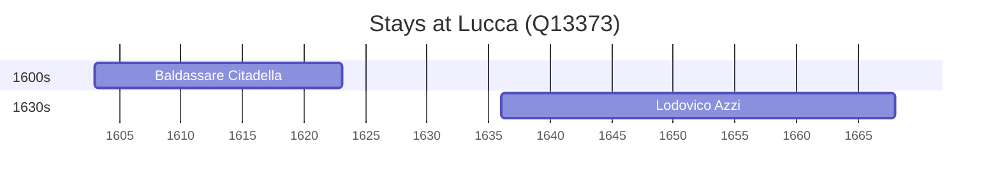

# Lucca (Q13373)

*city and comune in Tuscany, Central Italy*

Wikidata: [Q13373](https://www.wikidata.org/wiki/Q13373)

2 occurrence(s) across 1 transcribed value(s), 2 person(s).

**Transcribed variants:**

- `Lucca` (2×, 1603–1635)

| Date | Variant | Person | Type | Entity id | Real entity |
|------|---------|--------|------|-----------|-------------|
| 1603 | Lucca | Baldassare Citadella | nascimento | [deh-baldassare-citadella](deh-baldassare-citadella) | — |
| 1635-12-30 | Lucca | Lodovico Azzi | nascimento | [deh-lodovico-azzi](deh-lodovico-azzi) | — |

