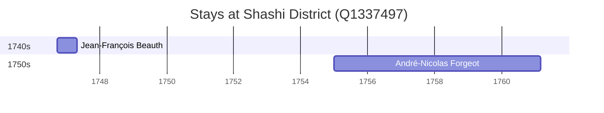

# Shashi District (Q1337497)

*district in Hubei Province, China*

Wikidata: [Q1337497](https://www.wikidata.org/wiki/Q1337497)

2 occurrence(s) across 2 transcribed value(s), 2 person(s).

**Transcribed variants:**

- `Shasi (Chache) Hupeh` (1×, 1746–1746)
- `Shasi (Cha-che), Hupeh` (1×, 1755–1755)

| Date | Variant | Person | Type | Entity id | Real entity |
|------|---------|--------|------|-----------|-------------|
| 1746-09-26 | Shasi (Chache) Hupeh | Jean-François Beauth | estadia | [deh-jean-francois-beauth](deh-jean-francois-beauth) | — |
| 1755 | Shasi (Cha-che), Hupeh | André-Nicolas Forgeot | estadia | [deh-andre-nicolas-forgeot](deh-andre-nicolas-forgeot) | — |

