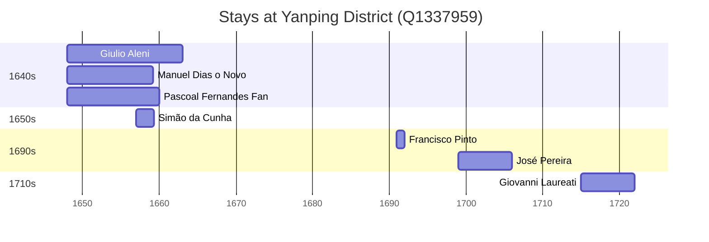

# Yanping District (Q1337959)

*district of China*

Wikidata: [Q1337959](https://www.wikidata.org/wiki/Q1337959)

10 occurrence(s) across 9 transcribed value(s), 8 person(s).

**Transcribed variants:**

- `Yenping fou, Fukien` (1×, 1648–1648)
- `Yenping, Fukien` (1×, 1648–1648)
- `Yenping, Yen-p'ing, Fukien` (1×, 1648–1648)
- `Yenping (Yen-p'ing), Fukien` (1×, 1657–1657)
- `Yenping, Foukien` (1×, 1691–1691)
- `Yen-ping, Fukien` (2×, 1699–1706)
- `Yen-p'ing fou, Fukien` (1×, 1715–1715)
- `Yen-ping` (1×, undated)
- `Yen-ping (corte de Long-wou)` (1×, undated)

| Date | Variant | Person | Type | Entity id | Real entity |
|------|---------|--------|------|-----------|-------------|
| — | Yen-ping | Martino Martini | estadia | [deh-martino-martini](deh-martino-martini) | — |
| — | Yen-ping (corte de Long-wou) | Martino Martini | estadia | [deh-martino-martini](deh-martino-martini) | — |
| 1648 | Yenping, Fukien | Pascoal Fernandes Fan | chegada | [deh-pascoal-fernandes-fan](deh-pascoal-fernandes-fan) | — |
| 1648 | Yenping, Yen-p'ing, Fukien | Giulio Aleni | estadia | [deh-giulio-aleni](deh-giulio-aleni) | — |
| 1648 | Yenping fou, Fukien | Manuel Dias, o Novo | estadia | [deh-manuel-dias-o-novo](deh-manuel-dias-o-novo) | — |
| 1657 | Yenping (Yen-p'ing), Fukien | Simão da Cunha | estadia | [deh-simao-da-cunha](deh-simao-da-cunha) | — |
| 1691 | Yenping, Foukien | Francisco Pinto | estadia | [deh-francisco-pinto-i](deh-francisco-pinto-i) | — |
| 1699 | Yen-ping, Fukien | José Pereira | estadia | [deh-jose-pereira](deh-jose-pereira) | — |
| 1706 | Yen-ping, Fukien | José Pereira | estadia | [deh-jose-pereira](deh-jose-pereira) | — |
| 1715 | Yen-p'ing fou, Fukien | Giovanni Laureati | estadia | [deh-giovanni-laureati](deh-giovanni-laureati) | [rp323905](rp323905) |

### Co-presence

These persons were plausibly at this place during overlapping periods (interval estimation from stay dates; rough — see method note below).

| Period | Persons |
|--------|---------|
| 1640s | [Manuel Dias, o Novo](deh-manuel-dias-o-novo), [Pascoal Fernandes Fan](deh-pascoal-fernandes-fan) |
| 1650s | [Manuel Dias, o Novo](deh-manuel-dias-o-novo), [Pascoal Fernandes Fan](deh-pascoal-fernandes-fan), [Simão da Cunha](deh-simao-da-cunha) |

*3 overlapping pair(s) involving 3 person(s). Method: interval start = stay event date; end = next embarque/partida/different-place event, or death, or +15yr cap.*

