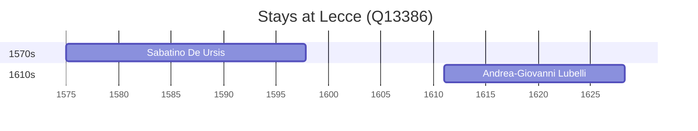

# Lecce (Q13386)

*Italian comune*

Wikidata: [Q13386](https://www.wikidata.org/wiki/Q13386)

2 occurrence(s) across 2 transcribed value(s), 2 person(s).

**Transcribed variants:**

- `Lecce, Itália` (1×, 1575–1575)
- `Lecce` (1×, 1611–1611)

| Date | Variant | Person | Type | Entity id | Real entity |
|------|---------|--------|------|-----------|-------------|
| 1575 | Lecce, Itália | Sabatino De Ursis | nascimento | [deh-sabatino-de-ursis](deh-sabatino-de-ursis) | — |
| 1611 | Lecce | Andrea-Giovanni Lubelli | nascimento | [deh-andrea-giovanni-lubelli](deh-andrea-giovanni-lubelli) | — |

