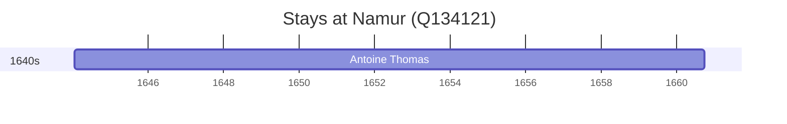

# Namur (Q134121)

*capital of Wallonia, Belgium*

Wikidata: [Q134121](https://www.wikidata.org/wiki/Q134121)

2 occurrence(s) across 1 transcribed value(s), 1 person(s).

**Transcribed variants:**

- `Namur` (2×, 1644–1660)

| Date | Variant | Person | Type | Entity id | Real entity |
|------|---------|--------|------|-----------|-------------|
| 1644-01-25 | Namur | Antoine Thomas | nascimento | [deh-antoine-thomas](deh-antoine-thomas) | [rp486350](rp486350) |
| 1660-09-08 | Namur | Antoine Thomas | estadia | [deh-antoine-thomas](deh-antoine-thomas) | [rp486350](rp486350) |

