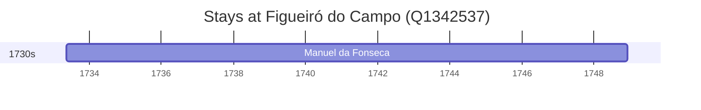

# Figueiró do Campo (Q1342537)

*civil parish in Soure*

Wikidata: [Q1342537](https://www.wikidata.org/wiki/Q1342537)

1 occurrence(s) across 1 transcribed value(s), 1 person(s).

**Transcribed variants:**

- `Figueiró-do-Campo, diocese de Coimbra` (1×, 1733–1733)

| Date | Variant | Person | Type | Entity id | Real entity |
|------|---------|--------|------|-----------|-------------|
| 1733-05-16 | Figueiró-do-Campo, diocese de Coimbra | Manuel da Fonseca | nascimento | [deh-manuel-da-fonseca](deh-manuel-da-fonseca) | — |

