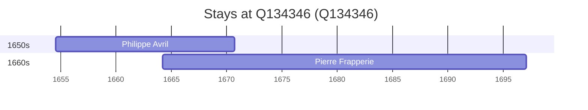

# Q134346

*(fetch error: HTTP Error 429: Too Many Requests)*

Wikidata: [Q134346](https://www.wikidata.org/wiki/Q134346)

2 occurrence(s) across 2 transcribed value(s), 2 person(s).

**Transcribed variants:**

- `Angoulême (paróquia de Notre-Dame de Beaulieu)` (1×, 1654–1654)
- `Angoulême` (1×, 1664–1664)

| Date | Variant | Person | Type | Entity id | Real entity |
|------|---------|--------|------|-----------|-------------|
| 1654-07-21 | Angoulême (paróquia de Notre-Dame de Beaulieu) | Philippe Avril | nascimento | [deh-philippe-avril](deh-philippe-avril) | [rp636254](rp636254) |
| 1664-03-09 | Angoulême | Pierre Frapperie | nascimento | [deh-pierre-frapperie](deh-pierre-frapperie) | — |

### Co-presence

These persons were plausibly at this place during overlapping periods (interval estimation from stay dates; rough — see method note below).

| Period | Persons |
|--------|---------|
| 1660s | [Philippe Avril](rp636254), [Pierre Frapperie](deh-pierre-frapperie) |

*1 overlapping pair(s) involving 2 person(s). Method: interval start = stay event date; end = next embarque/partida/different-place event, or death, or +15yr cap.*

