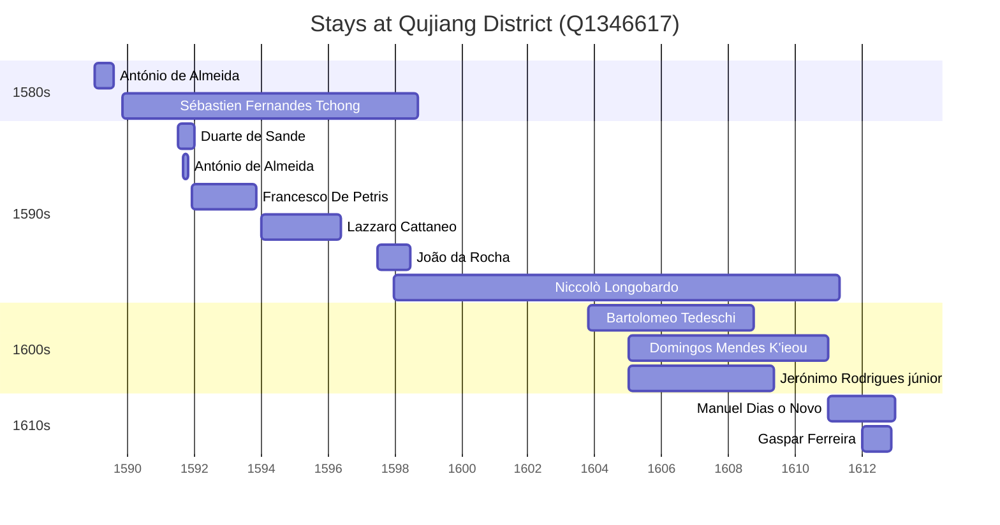

# Qujiang District (Q1346617)

*district in Guangdong, People's Republic of China*

Wikidata: [Q1346617](https://www.wikidata.org/wiki/Q1346617)

22 occurrence(s) across 6 transcribed value(s), 13 person(s).

**Transcribed variants:**

- `Kwangtung, (Residência de Shiuchow, Chao-tcheou)` (1×, 1589–1589)
- `Shiuchow` (4×, 1589–1605)
- `Shiuchow (Chao-tcheou)` (8×, 1589–1612)
- `Chao-tcheou` (7×, 1591–1609)
- `Shiuchow, Chao-techeou fou` (1×, 1591–1591)
- `Chao-tcheou, Shiuchow` (1×, 1599–1599)

| Date | Variant | Person | Type | Entity id | Real entity |
|------|---------|--------|------|-----------|-------------|
| — | Chao-tcheou | Bartolomeo Tedeschi | estadia | [deh-bartolomeo-tedeschi](deh-bartolomeo-tedeschi) | [rp086162](rp086162) |
| 1589 | Kwangtung, (Residência de Shiuchow, Chao-tcheou) | António de Almeida | estadia | [deh-antonio-de-almeida](deh-antonio-de-almeida) | — |
| 1589-10 | Shiuchow (Chao-tcheou) | Matteo Ricci | estadia | [deh-matteo-ricci](deh-matteo-ricci) | [rp302155](rp302155) |
| 1589-11 | Shiuchow | Sébastien Fernandes Tchong | jesuita-entrada | [deh-sebastien-fernandes-tchong](deh-sebastien-fernandes-tchong) | — |
| 1591-07 | Chao-tcheou | Duarte de Sande | estadia | [deh-duarte-de-sande](deh-duarte-de-sande) | — |
| 1591-09 | Shiuchow | António de Almeida | estadia | [deh-antonio-de-almeida](deh-antonio-de-almeida) | — |
| 1591-09 | Chao-tcheou | Duarte de Sande | estadia | [deh-duarte-de-sande](deh-duarte-de-sande) | — |
| 1591-10-17 | Shiuchow | António de Almeida | morte | [deh-antonio-de-almeida](deh-antonio-de-almeida) | — |
| 1591-11 | Shiuchow, Chao-techeou fou | Sébastien Fernandes Tchong | estadia | [deh-sebastien-fernandes-tchong](deh-sebastien-fernandes-tchong) | — |
| 1591-12 | Shiuchow (Chao-tcheou) | Francesco De Petris | estadia | [deh-francesco-de-petris](deh-francesco-de-petris) | — |
| 1593-11-05 | Shiuchow (Chao-tcheou) | Francesco De Petris | morte | [deh-francesco-de-petris](deh-francesco-de-petris) | — |
| 1594 | Shiuchow (Chao-tcheou) | Lazzaro Cattaneo | estadia | [deh-lazzaro-cattaneo](deh-lazzaro-cattaneo) | — |
| 1597-07 | Chao-tcheou | João da Rocha | estadia | [deh-joao-da-rocha](deh-joao-da-rocha) | — |
| 1597-12-28 | Shiuchow (Chao-tcheou) | Niccolò Longobardo | estadia | [deh-niccolo-longobardo](deh-niccolo-longobardo) | — |
| 1599-11-12 | Chao-tcheou, Shiuchow | Niccolò Longobardo | jesuita-votos-local | [deh-niccolo-longobardo](deh-niccolo-longobardo) | — |
| 1603-10-18 | Chao-tcheou | Bartolomeo Tedeschi | estadia | [deh-bartolomeo-tedeschi](deh-bartolomeo-tedeschi) | [rp086162](rp086162) |
| 1605 | Shiuchow | Domingos Mendes K'ieou | jesuita-entrada | [deh-domingos-mendes-kieou](deh-domingos-mendes-kieou) | — |
| 1605-01 | Chao-tcheou | Jerónimo Rodrigues, júnior | estadia | [deh-jeronimo-rodrigues-junior](deh-jeronimo-rodrigues-junior) | — |
| 1609-07-25 | Chao-tcheou | Bartolomeo Tedeschi | morte | [deh-bartolomeo-tedeschi](deh-bartolomeo-tedeschi) | [rp086162](rp086162) |
| 1611 | Shiuchow (Chao-tcheou) | Niccolò Longobardo | estadia | [deh-niccolo-longobardo](deh-niccolo-longobardo) | — |
| 1611 | Shiuchow (Chao-tcheou) | Manuel Dias, o Novo | estadia | [deh-manuel-dias-o-novo](deh-manuel-dias-o-novo) | — |
| 1612 | Shiuchow (Chao-tcheou) | Gaspar Ferreira | estadia | [deh-gaspar-ferreira](deh-gaspar-ferreira) | — |

### Co-presence

These persons were plausibly at this place during overlapping periods (interval estimation from stay dates; rough — see method note below).

| Period | Persons |
|--------|---------|
| 1590s | [António de Almeida](deh-antonio-de-almeida), [Duarte de Sande](deh-duarte-de-sande), [Francesco De Petris](deh-francesco-de-petris), [João da Rocha](deh-joao-da-rocha), [Lazzaro Cattaneo](deh-lazzaro-cattaneo), [Niccolò Longobardo](deh-niccolo-longobardo), [Sébastien Fernandes Tchong](deh-sebastien-fernandes-tchong) |
| 1600s | [Bartolomeo Tedeschi](rp086162), [Domingos Mendes K'ieou](deh-domingos-mendes-kieou), [Jerónimo Rodrigues, júnior](deh-jeronimo-rodrigues-junior), [Niccolò Longobardo](deh-niccolo-longobardo) |
| 1610s | [Gaspar Ferreira](deh-gaspar-ferreira), [Manuel Dias, o Novo](deh-manuel-dias-o-novo), [Niccolò Longobardo](deh-niccolo-longobardo) |

*17 overlapping pair(s) involving 12 person(s). Method: interval start = stay event date; end = next embarque/partida/different-place event, or death, or +15yr cap.*

