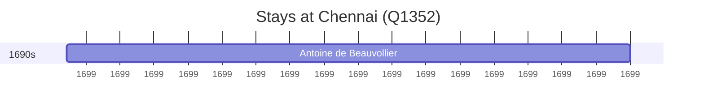

# Chennai (Q1352)

*city and state capital of Tamil Nadu, India*

Wikidata: [Q1352](https://www.wikidata.org/wiki/Q1352)

2 occurrence(s) across 1 transcribed value(s), 2 person(s).

**Transcribed variants:**

- `Chennai, Índia` (2×, 1699–1699)

| Date | Variant | Person | Type | Entity id | Real entity |
|------|---------|--------|------|-----------|-------------|
| — | Chennai, Índia | François-Xavier Dentrecolles | estadia | [deh-francois-xavier-dentrecolles](deh-francois-xavier-dentrecolles) | — |
| 1699-07-08 | Chennai, Índia | Antoine de Beauvollier | estadia | [deh-antoine-de-beauvollier](deh-antoine-de-beauvollier) | — |

