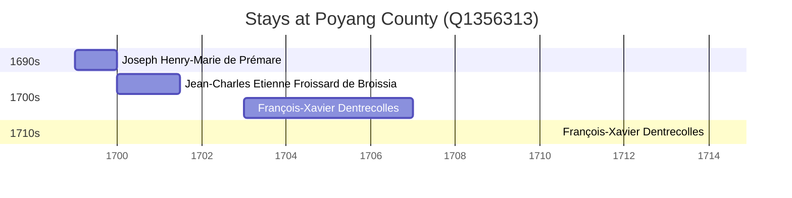

# Poyang County (Q1356313)

*county in Shangrao, Jiangxi, China*

Wikidata: [Q1356313](https://www.wikidata.org/wiki/Q1356313)

4 occurrence(s) across 4 transcribed value(s), 3 person(s).

**Transcribed variants:**

- `Jaochow (Jao-tcheou), Kiangsi` (1×, 1699–1699)
- `Jaochow, Kiangis` (1×, 1700–1700)
- `Jaochow, Kingtechen` (1×, 1703–1703)
- `Jaochow` (1×, 1714–1714)

| Date | Variant | Person | Type | Entity id | Real entity |
|------|---------|--------|------|-----------|-------------|
| 1699 | Jaochow (Jao-tcheou), Kiangsi | Joseph Henry-Marie de Prémare | estadia | [deh-joseph-henry-marie-de-premare](deh-joseph-henry-marie-de-premare) | — |
| 1700 | Jaochow, Kiangis | Jean-Charles Etienne Froissard de Broissia | estadia | [deh-jean-charles-etienne-froissard-de-broissia](deh-jean-charles-etienne-froissard-de-broissia) | — |
| 1703 | Jaochow, Kingtechen | François-Xavier Dentrecolles | estadia | [deh-francois-xavier-dentrecolles](deh-francois-xavier-dentrecolles) | — |
| 1714 | Jaochow | François-Xavier Dentrecolles | estadia | [deh-francois-xavier-dentrecolles](deh-francois-xavier-dentrecolles) | — |

