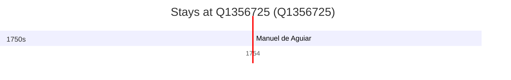

# Q1356725

*(fetch error: HTTP Error 429: Too Many Requests)*

Wikidata: [Q1356725](https://www.wikidata.org/wiki/Q1356725)

1 occurrence(s) across 1 transcribed value(s), 1 person(s).

**Transcribed variants:**

- `Nangeng, Kiangxi, China` (1×, 1754–1754)

| Date | Variant | Person | Type | Entity id | Real entity |
|------|---------|--------|------|-----------|-------------|
| 1754-05-23 | Nangeng, Kiangxi, China | Manuel de Aguiar | jesuita-votos-local | [deh-manuel-de-aguiar](deh-manuel-de-aguiar) | — |

