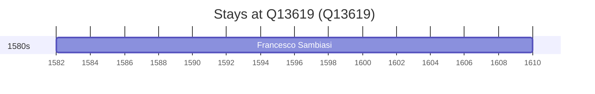

# Q13619

*(fetch error: HTTP Error 429: Too Many Requests)*

Wikidata: [Q13619](https://www.wikidata.org/wiki/Q13619)

1 occurrence(s) across 1 transcribed value(s), 1 person(s).

**Transcribed variants:**

- `Cosenza, Calabria` (1×, 1582–1582)

| Date | Variant | Person | Type | Entity id | Real entity |
|------|---------|--------|------|-----------|-------------|
| 1582 | Cosenza, Calabria | Francesco Sambiasi | nascimento | [deh-francesco-sambiasi](deh-francesco-sambiasi) | — |

