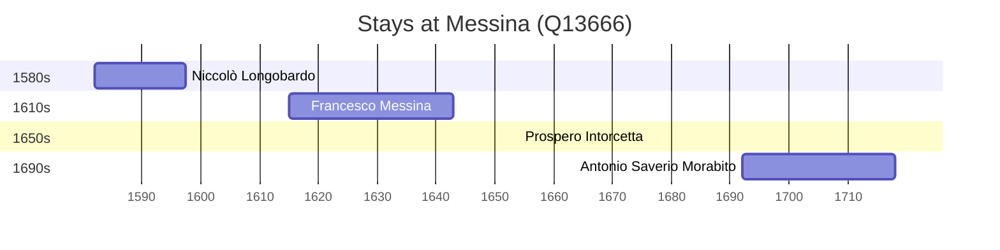

# Messina (Q13666)

*Italian comune in Sicily*

Wikidata: [Q13666](https://www.wikidata.org/wiki/Q13666)

5 occurrence(s) across 1 transcribed value(s), 4 person(s).

**Transcribed variants:**

- `Messina` (5×, 1582–1706)

| Date | Variant | Person | Type | Entity id | Real entity |
|------|---------|--------|------|-----------|-------------|
| 1582 | Messina | Niccolò Longobardo | jesuita-entrada | [deh-niccolo-longobardo](deh-niccolo-longobardo) | — |
| 1614-12-21 | Messina | Francesco Messina | nascimento | [deh-francesco-messina](deh-francesco-messina) | — |
| 1654 | Messina | Prospero Intorcetta | jesuita-ordenacao-padre | [deh-prospero-intorcetta](deh-prospero-intorcetta) | — |
| 1691-12-30 | Messina | Antonio Saverio Morabito | nascimento | [deh-antonio-saverio-morabito](deh-antonio-saverio-morabito) | — |
| 1706-12-07 | Messina | Antonio Saverio Morabito | jesuita-entrada | [deh-antonio-saverio-morabito](deh-antonio-saverio-morabito) | — |

