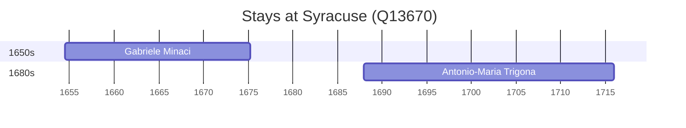

# Syracuse (Q13670)

*Italian municipality*

Wikidata: [Q13670](https://www.wikidata.org/wiki/Q13670)

2 occurrence(s) across 2 transcribed value(s), 2 person(s).

**Transcribed variants:**

- `Siracusa, Sicília` (1×, 1654–1654)
- `Siracusa` (1×, 1687–1687)

| Date | Variant | Person | Type | Entity id | Real entity |
|------|---------|--------|------|-----------|-------------|
| 1654-06-22 | Siracusa, Sicília | Gabriele Minaci | nascimento | [deh-gabriele-minaci](deh-gabriele-minaci) | — |
| 1687-12-19 | Siracusa | Antonio-Maria Trigona | nascimento | [deh-antonio-maria-trigona](deh-antonio-maria-trigona) | — |

