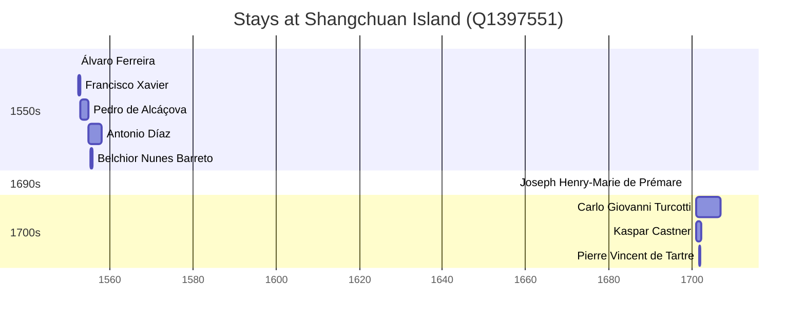

# Shangchuan Island (Q1397551)

*island of Guangdong, China*

Wikidata: [Q1397551](https://www.wikidata.org/wiki/Q1397551)

10 occurrence(s) across 1 transcribed value(s), 9 person(s).

**Transcribed variants:**

- `Shangchuan` (10×, 1552–1701)

| Date | Variant | Person | Type | Entity id | Real entity |
|------|---------|--------|------|-----------|-------------|
| 1552 | Shangchuan | Álvaro Ferreira | estadia | [deh-alvaro-ferreira](deh-alvaro-ferreira) | — |
| 1552-08 | Shangchuan | Francisco Xavier | chegada | [deh-francisco-xavier](deh-francisco-xavier) | — |
| 1552-12-02 | Shangchuan | Francisco Xavier | morte | [deh-francisco-xavier](deh-francisco-xavier) | — |
| 1553 | Shangchuan | Pedro de Alcáçova | estadia | [deh-pedro-de-alcacova](deh-pedro-de-alcacova) | — |
| 1555 | Shangchuan | Antonio Díaz | estadia | [deh-antonio-diaz](deh-antonio-diaz) | — |
| 1555-07-15 | Shangchuan | Belchior Nunes Barreto | estadia | [deh-belchior-nunes-barreto](deh-belchior-nunes-barreto) | [rp606650](rp606650) |
| 1698-10-06 | Shangchuan | Joseph Henry-Marie de Prémare | chegada | [deh-joseph-henry-marie-de-premare](deh-joseph-henry-marie-de-premare) | — |
| 1700-11-19 | Shangchuan | Carlo Giovanni Turcotti | estadia | [deh-carlo-giovanni-turcotti](deh-carlo-giovanni-turcotti) | — |
| 1701 | Shangchuan | Kaspar Castner | estadia | [deh-kaspar-castner](deh-kaspar-castner) | — |
| 1701-08-07 | Shangchuan | Pierre Vincent de Tartre | chegada | [deh-pierre-vincent-de-tartre](deh-pierre-vincent-de-tartre) | — |

### Co-presence

These persons were plausibly at this place during overlapping periods (interval estimation from stay dates; rough — see method note below).

| Period | Persons |
|--------|---------|
| 1550s | [Antonio Díaz](deh-antonio-diaz), [Belchior Nunes Barreto](rp606650) |
| 1700s | [Carlo Giovanni Turcotti](deh-carlo-giovanni-turcotti), [Kaspar Castner](deh-kaspar-castner), [Pierre Vincent de Tartre](deh-pierre-vincent-de-tartre) |

*4 overlapping pair(s) involving 5 person(s). Method: interval start = stay event date; end = next embarque/partida/different-place event, or death, or +15yr cap.*

