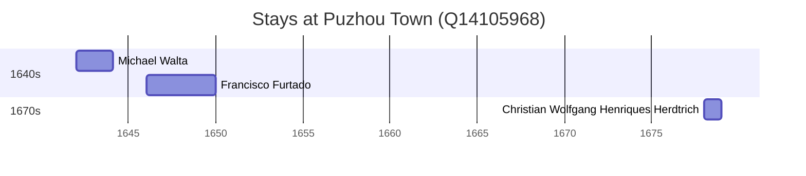

# Puzhou Town (Q14105968)

Wikidata: [Q14105968](https://www.wikidata.org/wiki/Q14105968)

5 occurrence(s) across 3 transcribed value(s), 3 person(s).

**Transcribed variants:**

- `Puchow` (2×, 1642–1678)
- `Puchow, Chan-si` (1×, 1644–1644)
- `Puchow, Shansi` (2×, 1646–1647)

| Date | Variant | Person | Type | Entity id | Real entity |
|------|---------|--------|------|-----------|-------------|
| 1642 | Puchow | Michael Walta | estadia | [deh-michael-walta](deh-michael-walta) | — |
| 1644-02 | Puchow, Chan-si | Michael Walta | morte | [deh-michael-walta](deh-michael-walta) | — |
| 1646 | Puchow, Shansi | Francisco Furtado | estadia | [deh-francisco-furtado](deh-francisco-furtado) | — |
| 1647 | Puchow, Shansi | Francisco Furtado | estadia | [deh-francisco-furtado](deh-francisco-furtado) | — |
| 1678 | Puchow | Christian Wolfgang Henriques Herdtrich | estadia | [deh-christian-wolfgang-henriques-herdtrich](deh-christian-wolfgang-henriques-herdtrich) | [rp669413](rp669413) |

