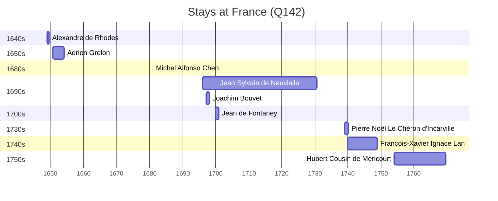

# France (Q142)

*country in Western Europe and other continents (through its overseas territories in America, Africa and Oceania)*

Wikidata: [Q142](https://www.wikidata.org/wiki/Q142)

17 occurrence(s) across 2 transcribed value(s), 14 person(s).

**Transcribed variants:**

- `França` (16×, 1693–1740)
- `?` (1×, 1754–1754)

| Date | Variant | Person | Type | Entity id | Real entity |
|------|---------|--------|------|-----------|-------------|
| — | França | Claudio Filippo Grimaldi | estadia | [deh-claudio-filippo-grimaldi](deh-claudio-filippo-grimaldi) | — |
| — | França | Denis Li Thang | estadia | [deh-denis-li-thang](deh-denis-li-thang) | — |
| — | França | Louis-Daniel Le Comte | estadia | [deh-louis-daniel-le-comte](deh-louis-daniel-le-comte) | — |
| — | França | Thomas Jean-Baptiste Lieou | partida | [deh-thomas-jean-baptiste-lieou](deh-thomas-jean-baptiste-lieou) | — |
| 1693-07-04 | França | Joachim Bouvet | partida | [deh-joachim-bouvet](deh-joachim-bouvet) | [rp407623](rp407623) |
| 1696-02-01 | França | Jean Sylvain de Neuvialle | nascimento | [deh-jean-sylvain-de-neuvialle](deh-jean-sylvain-de-neuvialle) | — |
| 1697-03 | França | Joachim Bouvet | estadia | [deh-joachim-bouvet](deh-joachim-bouvet) | [rp407623](rp407623) |
| 1699 | França | Jean de Fontaney | partida | [deh-jean-de-fontaney](deh-jean-de-fontaney) | — |
| 1700 | França | Jean de Fontaney | chegada | [deh-jean-de-fontaney](deh-jean-de-fontaney) | — |
| 1706-01-02 | França | Joachim Bouvet | partida | [deh-joachim-bouvet](deh-joachim-bouvet) | [rp407623](rp407623) |
| 1722-12 | França | Jean-Baptiste Simon Gravereau | partida | [deh-jean-baptiste-simon-gravereau](deh-jean-baptiste-simon-gravereau) | — |
| 1740 | França | François-Xavier Ignace Lan | estadia | [deh-francois-xavier-ignace-lan](deh-francois-xavier-ignace-lan) | — |
| 1754-01-08 | ? | Hubert Cousin de Méricourt | jesuita-entrada | [deh-hubert-cousin-de-mericourt](deh-hubert-cousin-de-mericourt) | — |
| >1649 | França | Alexandre de Rhodes | estadia | [deh-alexandre-de-rhodes](deh-alexandre-de-rhodes) | — |
| >1650-08-23:<1653 | França | Adrien Grelon | estadia | [deh-adrien-grelon](deh-adrien-grelon) | — |
| >1681:<1687 | França | Michel Alfonso Chen | estadia | [deh-michel-alfonso-chen](deh-michel-alfonso-chen) | — |
| >1739 | França | Pierre Noël Le Chéron d'Incarville | estadia | [deh-pierre-noel-le-cheron-dincarville](deh-pierre-noel-le-cheron-dincarville) | — |

### Co-presence

These persons were plausibly at this place during overlapping periods (interval estimation from stay dates; rough — see method note below).

| Period | Persons |
|--------|---------|
| 1690s | [Jean Sylvain de Neuvialle](deh-jean-sylvain-de-neuvialle), [Joachim Bouvet](rp407623) |
| 1700s | [Jean Sylvain de Neuvialle](deh-jean-sylvain-de-neuvialle), [Jean de Fontaney](deh-jean-de-fontaney) |
| 1740s | [François-Xavier Ignace Lan](deh-francois-xavier-ignace-lan), [Pierre Noël Le Chéron d'Incarville](deh-pierre-noel-le-cheron-dincarville) |

*3 overlapping pair(s) involving 5 person(s). Method: interval start = stay event date; end = next embarque/partida/different-place event, or death, or +15yr cap.*

