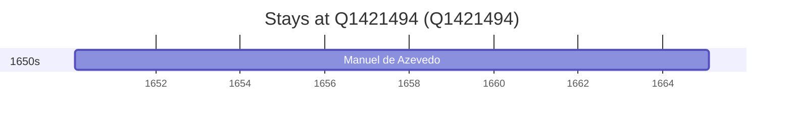

# Q1421494

*(fetch error: HTTP Error 429: Too Many Requests)*

Wikidata: [Q1421494](https://www.wikidata.org/wiki/Q1421494)

1 occurrence(s) across 1 transcribed value(s), 1 person(s).

**Transcribed variants:**

- `Solor` (1×, undated)

| Date | Variant | Person | Type | Entity id | Real entity |
|------|---------|--------|------|-----------|-------------|
| >1614-04-08:<1637 | Solor | Manuel de Azevedo | estadia | [deh-manuel-de-azevedo](deh-manuel-de-azevedo) | — |

