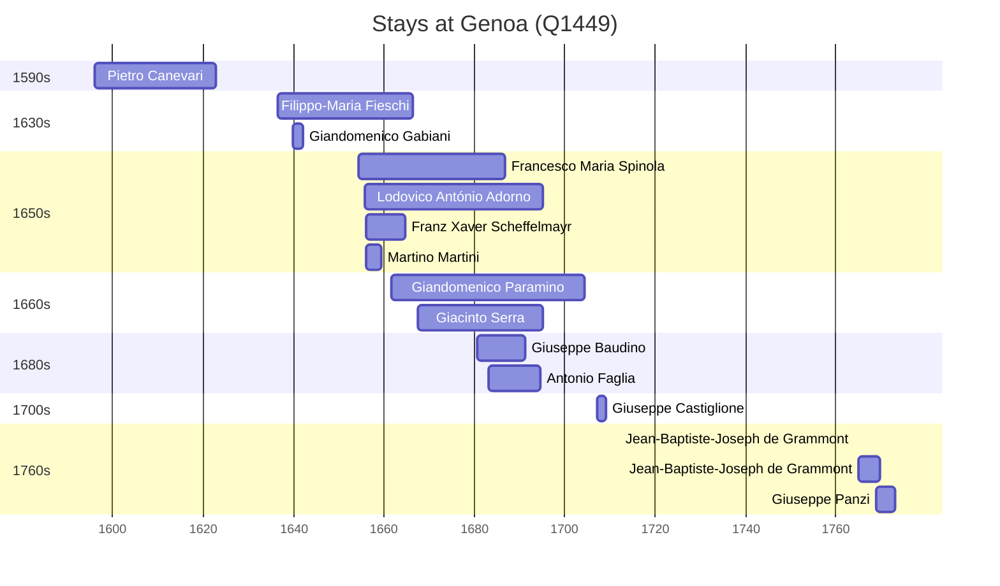

# Genoa (Q1449)

*Italian city*

Wikidata: [Q1449](https://www.wikidata.org/wiki/Q1449)

18 occurrence(s) across 2 transcribed value(s), 14 person(s).

**Transcribed variants:**

- `Génova` (17×, 1596–1768)
- `Génova, Itália` (1×, 1655–1655)

| Date | Variant | Person | Type | Entity id | Real entity |
|------|---------|--------|------|-----------|-------------|
| 1596 | Génova | Pietro Canevari | nascimento | [deh-pietro-canevari](deh-pietro-canevari) | — |
| 1636-05-24 | Génova | Filippo-Maria Fieschi | nascimento | [deh-filippo-maria-fieschi](deh-filippo-maria-fieschi) | — |
| 1639-09-15 | Génova | Giandomenico Gabiani | jesuita-entrada | [deh-giandomenico-gabiani](deh-giandomenico-gabiani) | [rp565060](rp565060) |
| 1652-09-05 | Génova | Filippo-Maria Fieschi | jesuita-entrada | [deh-filippo-maria-fieschi](deh-filippo-maria-fieschi) | — |
| 1654-04-05 | Génova | Francesco Maria Spinola | nascimento | [deh-francesco-maria-spinola](deh-francesco-maria-spinola) | [rp574322](rp574322) |
| 1655-08-28 | Génova, Itália | Lodovico António Adorno | nascimento | [deh-ludovico-antonio-adorno](deh-ludovico-antonio-adorno) | — |
| 1656-01-08 | Génova | Franz Xaver Scheffelmayr | estadia | [deh-franz-xaver-scheffelmayr](deh-franz-xaver-scheffelmayr) | — |
| 1656-01-08 | Génova | Martino Martini | estadia | [deh-martino-martini](deh-martino-martini) | — |
| 1661-09-29 | Génova | Giandomenico Paramino | nascimento | [deh-giandomenico-paramino](deh-giandomenico-paramino) | — |
| 1667-05-12 | Génova | Giacinto Serra | nascimento | [deh-giacinto-serra](deh-giacinto-serra) | — |
| 1673-06-01 | Génova | Francesco Maria Spinola | jesuita-entrada | [deh-francesco-maria-spinola](deh-francesco-maria-spinola) | [rp574322](rp574322) |
| 1680-08-11 | Génova | Giuseppe Baudino | jesuita-entrada | [deh-giuseppe-baudino](deh-giuseppe-baudino) | — |
| 1680-12-02 | Génova | Lodovico António Adorno | jesuita-entrada | [deh-ludovico-antonio-adorno](deh-ludovico-antonio-adorno) | — |
| 1683-01-27 | Génova | Antonio Faglia | jesuita-entrada | [deh-antonio-faglia](deh-antonio-faglia) | — |
| 1707-01-16 | Génova | Giuseppe Castiglione | jesuita-entrada | [deh-giuseppe-castiglione](deh-giuseppe-castiglione) | — |
| 1764 | Génova | Jean-Baptiste-Joseph de Grammont | jesuita-ordenacao-padre | [deh-jean-baptiste-joseph-de-grammont](deh-jean-baptiste-joseph-de-grammont) | — |
| 1765 | Génova | Jean-Baptiste-Joseph de Grammont | estadia | [deh-jean-baptiste-joseph-de-grammont](deh-jean-baptiste-joseph-de-grammont) | — |
| 1768-09-30 | Génova | Giuseppe Panzi | jesuita-entrada | [deh-giuseppe-panzi](deh-giuseppe-panzi) | — |

### Co-presence

These persons were plausibly at this place during overlapping periods (interval estimation from stay dates; rough — see method note below).

| Period | Persons |
|--------|---------|
| 1630s | [Filippo-Maria Fieschi](deh-filippo-maria-fieschi), [Giandomenico Gabiani](rp565060) |
| 1650s | [Filippo-Maria Fieschi](deh-filippo-maria-fieschi), [Francesco Maria Spinola](rp574322), [Franz Xaver Scheffelmayr](deh-franz-xaver-scheffelmayr), [Lodovico António Adorno](deh-ludovico-antonio-adorno), [Martino Martini](deh-martino-martini) |
| 1660s | [Filippo-Maria Fieschi](deh-filippo-maria-fieschi), [Francesco Maria Spinola](rp574322), [Franz Xaver Scheffelmayr](deh-franz-xaver-scheffelmayr), [Giacinto Serra](deh-giacinto-serra), [Giandomenico Paramino](deh-giandomenico-paramino), [Lodovico António Adorno](deh-ludovico-antonio-adorno) |
| 1680s | [Antonio Faglia](deh-antonio-faglia), [Francesco Maria Spinola](rp574322), [Giacinto Serra](deh-giacinto-serra), [Giandomenico Paramino](deh-giandomenico-paramino), [Giuseppe Baudino](deh-giuseppe-baudino), [Lodovico António Adorno](deh-ludovico-antonio-adorno) |
| 1760s | [Giuseppe Panzi](deh-giuseppe-panzi), [Jean-Baptiste-Joseph de Grammont](deh-jean-baptiste-joseph-de-grammont) |

*28 overlapping pair(s) involving 12 person(s). Method: interval start = stay event date; end = next embarque/partida/different-place event, or death, or +15yr cap.*

