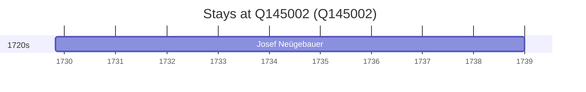

# Q145002

*(fetch error: HTTP Error 429: Too Many Requests)*

Wikidata: [Q145002](https://www.wikidata.org/wiki/Q145002)

1 occurrence(s) across 1 transcribed value(s), 1 person(s).

**Transcribed variants:**

- `Trenčín` (1×, 1729–1729)

| Date | Variant | Person | Type | Entity id | Real entity |
|------|---------|--------|------|-----------|-------------|
| 1729-10-27 | Trenčín | Josef Neügebauer | jesuita-entrada | [deh-josef-neugebauer](deh-josef-neugebauer) | — |

