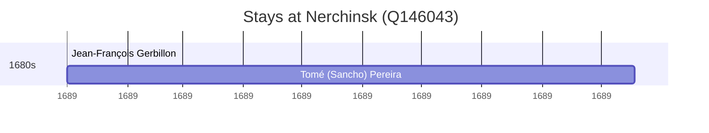

# Nerchinsk (Q146043)

*town in Nerchinsky District, Chita Oblast, Russia*

Wikidata: [Q146043](https://www.wikidata.org/wiki/Q146043)

2 occurrence(s) across 1 transcribed value(s), 2 person(s).

**Transcribed variants:**

- `Nerchinsk` (2×, 1689–1689)

| Date | Variant | Person | Type | Entity id | Real entity |
|------|---------|--------|------|-----------|-------------|
| 1689 | Nerchinsk | Jean-François Gerbillon | estadia | [deh-jean-francois-gerbillon](deh-jean-francois-gerbillon) | — |
| 1689 | Nerchinsk | Tomé (Sancho) Pereira | estadia | [deh-tome-pereira](deh-tome-pereira) | — |

