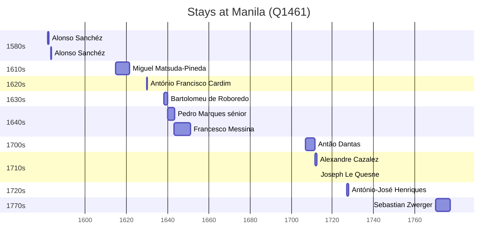

# Manila (Q1461)

*capital city of the Philippines*

Wikidata: [Q1461](https://www.wikidata.org/wiki/Q1461)

18 occurrence(s) across 2 transcribed value(s), 15 person(s).

**Transcribed variants:**

- `Manila` (17×, 1581–1770)
- `Manila (igreja de Sto. Inácio)` (1×, 1650–1650)

| Date | Variant | Person | Type | Entity id | Real entity |
|------|---------|--------|------|-----------|-------------|
| — | Manila | Giovanni Antonio Rubino | estadia | [deh-giovanni-antonio-rubino](deh-giovanni-antonio-rubino) | — |
| — | Manila | Louis Jean-Xavier Armand Nyel | estadia | [deh-louis-jean-xavier-armand-nyel](deh-louis-jean-xavier-armand-nyel) | — |
| — | Manila | Sebastião Vieira | estadia | [deh-sebastiao-vieira](deh-sebastiao-vieira) | — |
| 1581-09 | Manila | Alonso Sanchéz | estadia | [deh-alonso-sanchez](deh-alonso-sanchez) | — |
| 1583-02-13 | Manila | Alonso Sanchéz | partida | [deh-alonso-sanchez](deh-alonso-sanchez) | — |
| 1583-03-27 | Manila | Alonso Sanchéz | chegada | [deh-alonso-sanchez](deh-alonso-sanchez) | — |
| 1614-11 | Manila | Miguel Matsuda-Pineda | estadia | [deh-miguel-matsuda-pineda](deh-miguel-matsuda-pineda) | — |
| 1616-10-18 | Manila | Melchior Mora | morte | [deh-melchior-mora](deh-melchior-mora) | — |
| 1629-12-13 | Manila | António Francisco Cardim | estadia | [deh-antonio-francisco-cardim](deh-antonio-francisco-cardim) | [rp536947](rp536947) |
| 1638 | Manila | Bartolomeu de Roboredo | estadia | [deh-bartolomeu-de-roboredo](deh-bartolomeu-de-roboredo) | — |
| 1640 | Manila | Pedro Marques, sénior | estadia | [deh-pedro-marques-senior](deh-pedro-marques-senior) | — |
| 1643 | Manila | Francesco Messina | chegada | [deh-francesco-messina](deh-francesco-messina) | — |
| 1650-01-06 | Manila (igreja de Sto. Inácio) | Francesco Messina | jesuita-votos-local | [deh-francesco-messina](deh-francesco-messina) | — |
| 1707 | Manila | Antão Dantas | estadia | [deh-antao-dantas](deh-antao-dantas) | — |
| 1712-12 | Manila | Joseph Le Quesne | estadia | [deh-joseph-le-quesne](deh-joseph-le-quesne) | — |
| 1727 | Manila | António-José Henriques | estadia | [deh-antonio-jose-henriques](deh-antonio-jose-henriques) | — |
| 1770-01-23 | Manila | Sebastian Zwerger | estadia | [deh-sebastian-zwerger](deh-sebastian-zwerger) | — |
| <1711-07 | Manila | Alexandre Cazalez | estadia | [deh-alexandre-cazalez](deh-alexandre-cazalez) | — |

### Co-presence

These persons were plausibly at this place during overlapping periods (interval estimation from stay dates; rough — see method note below).

| Period | Persons |
|--------|---------|
| 1640s | [Francesco Messina](deh-francesco-messina), [Pedro Marques, sénior](deh-pedro-marques-senior) |
| 1710s | [Alexandre Cazalez](deh-alexandre-cazalez), [Antão Dantas](deh-antao-dantas) |

*2 overlapping pair(s) involving 4 person(s). Method: interval start = stay event date; end = next embarque/partida/different-place event, or death, or +15yr cap.*

