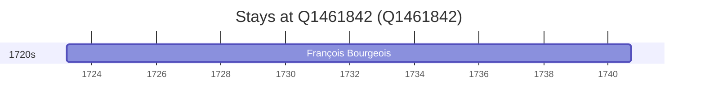

# Q1461842

*(fetch error: HTTP Error 429: Too Many Requests)*

Wikidata: [Q1461842](https://www.wikidata.org/wiki/Q1461842)

1 occurrence(s) across 1 transcribed value(s), 1 person(s).

**Transcribed variants:**

- `Remicourt, Vosges` (1×, 1723–1723)

| Date | Variant | Person | Type | Entity id | Real entity |
|------|---------|--------|------|-----------|-------------|
| 1723-03-21 | Remicourt, Vosges | François Bourgeois | nascimento | [deh-francois-bourgeois](deh-francois-bourgeois) | — |

