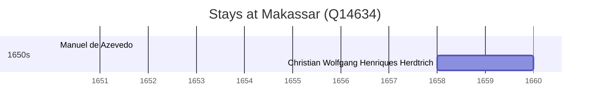

# Makassar (Q14634)

*city in South Sulawesi Province, Indonesia*

Wikidata: [Q14634](https://www.wikidata.org/wiki/Q14634)

3 occurrence(s) across 1 transcribed value(s), 2 person(s).

**Transcribed variants:**

- `Makassar` (3×, 1658–1659)

| Date | Variant | Person | Type | Entity id | Real entity |
|------|---------|--------|------|-----------|-------------|
| 1658 | Makassar | Christian Wolfgang Henriques Herdtrich | chegada | [deh-christian-wolfgang-henriques-herdtrich](deh-christian-wolfgang-henriques-herdtrich) | [rp669413](rp669413) |
| 1659-04-13 | Makassar | Christian Wolfgang Henriques Herdtrich | jesuita-votos-local | [deh-christian-wolfgang-henriques-herdtrich](deh-christian-wolfgang-henriques-herdtrich) | [rp669413](rp669413) |
| >1614-04-08:<1637 | Makassar | Manuel de Azevedo | estadia | [deh-manuel-de-azevedo](deh-manuel-de-azevedo) | — |

