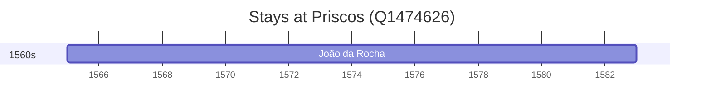

# Priscos (Q1474626)

*civil parish in Braga*

Wikidata: [Q1474626](https://www.wikidata.org/wiki/Q1474626)

1 occurrence(s) across 1 transcribed value(s), 1 person(s).

**Transcribed variants:**

- `Santiago de Priscos, diocese de Braga` (1×, 1565–1565)

| Date | Variant | Person | Type | Entity id | Real entity |
|------|---------|--------|------|-----------|-------------|
| 1565 | Santiago de Priscos, diocese de Braga | João da Rocha | nascimento | [deh-joao-da-rocha](deh-joao-da-rocha) | — |

