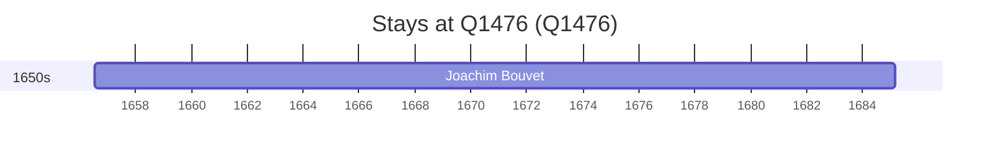

# Q1476

*(fetch error: HTTP Error 429: Too Many Requests)*

Wikidata: [Q1476](https://www.wikidata.org/wiki/Q1476)

1 occurrence(s) across 1 transcribed value(s), 1 person(s).

**Transcribed variants:**

- `Mans ou Conlie (Sarthe)` (1×, 1656–1656)

| Date | Variant | Person | Type | Entity id | Real entity |
|------|---------|--------|------|-----------|-------------|
| 1656-07-18 | Mans ou Conlie (Sarthe) | Joachim Bouvet | nascimento | [deh-joachim-bouvet](deh-joachim-bouvet) | [rp407623](rp407623) |

