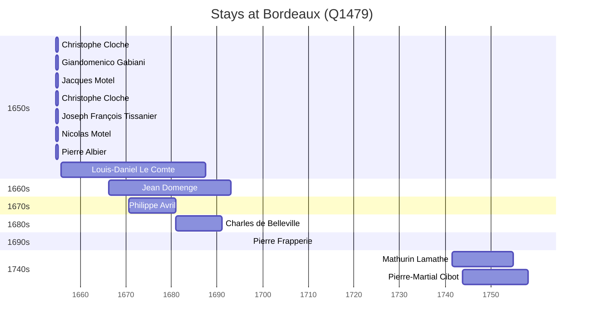

# Bordeaux (Q1479)

*city and commune in Gironde, New Aquitaine, France*

Wikidata: [Q1479](https://www.wikidata.org/wiki/Q1479)

17 occurrence(s) across 2 transcribed value(s), 14 person(s).

**Transcribed variants:**

- `Bordeaux` (16×, 1654–1743)
- `Bordeaux (paróquia de St. André)` (1×, 1666–1666)

| Date | Variant | Person | Type | Entity id | Real entity |
|------|---------|--------|------|-----------|-------------|
| 1654-08-30 | Bordeaux | Christophe Cloche | estadia | [deh-christophe-cloche](deh-christophe-cloche) | — |
| 1654-08-30 | Bordeaux | Giandomenico Gabiani | estadia | [deh-giandomenico-gabiani](deh-giandomenico-gabiani) | [rp565060](rp565060) |
| 1654-08-30 | Bordeaux | Jacques Motel | estadia | [deh-jacques-motel](deh-jacques-motel) | — |
| 1654-08-30 | Bordeaux | Christophe Cloche | estadia | [deh-jacques-motel-ref6](deh-jacques-motel-ref6) | — |
| 1654-08-30 | Bordeaux | Joseph François Tissanier | estadia | [deh-joseph-francois-tissanier](deh-joseph-francois-tissanier) | — |
| 1654-08-30 | Bordeaux | Nicolas Motel | estadia | [deh-nicolas-motel](deh-nicolas-motel) | — |
| 1654-08-30 | Bordeaux | Pierre Albier | estadia | [deh-pierre-albier](deh-pierre-albier) | — |
| 1655-10-10 | Bordeaux | Louis-Daniel Le Comte | nascimento | [deh-louis-daniel-le-comte](deh-louis-daniel-le-comte) | — |
| 1666-04-08 | Bordeaux | Jean Domenge | nascimento | [deh-jean-domenge](deh-jean-domenge) | — |
| 1666-04-11 | Bordeaux (paróquia de St. André) | Jean Domenge | baptizado | [deh-jean-domenge](deh-jean-domenge) | — |
| 1670-09-16 | Bordeaux | Philippe Avril | jesuita-entrada | [deh-philippe-avril](deh-philippe-avril) | [rp636254](rp636254) |
| 1671-10-15 | Bordeaux | Louis-Daniel Le Comte | jesuita-entrada | [deh-louis-daniel-le-comte](deh-louis-daniel-le-comte) | — |
| 1680-11-25 | Bordeaux | Charles de Belleville | jesuita-entrada | [deh-charles-de-belleville](deh-charles-de-belleville) | [rp033271](rp033271) |
| 1697-02-02 | Bordeaux | Pierre Frapperie | jesuita-votos-local | [deh-pierre-frapperie](deh-pierre-frapperie) | — |
| 1728-04-19 | Bordeaux | Louis-Daniel Le Comte | morte | [deh-louis-daniel-le-comte](deh-louis-daniel-le-comte) | — |
| 1741-07-24 | Bordeaux | Mathurin Lamathe | jesuita-entrada | [deh-mathurin-lamathe](deh-mathurin-lamathe) | — |
| 1743-11-07 | Bordeaux | Pierre-Martial Cibot | jesuita-entrada | [deh-pierre-martial-cibot](deh-pierre-martial-cibot) | [rp459497](rp459497) |

### Co-presence

These persons were plausibly at this place during overlapping periods (interval estimation from stay dates; rough — see method note below).

| Period | Persons |
|--------|---------|
| 1650s | [Christophe Cloche](deh-christophe-cloche), [Christophe Cloche](deh-jacques-motel-ref6), [Giandomenico Gabiani](rp565060), [Jacques Motel](deh-jacques-motel), [Joseph François Tissanier](deh-joseph-francois-tissanier), [Nicolas Motel](deh-nicolas-motel), [Pierre Albier](deh-pierre-albier) |
| 1660s | [Jean Domenge](deh-jean-domenge), [Louis-Daniel Le Comte](deh-louis-daniel-le-comte) |
| 1670s | [Jean Domenge](deh-jean-domenge), [Louis-Daniel Le Comte](deh-louis-daniel-le-comte), [Philippe Avril](rp636254) |
| 1680s | [Charles de Belleville](rp033271), [Jean Domenge](deh-jean-domenge), [Louis-Daniel Le Comte](deh-louis-daniel-le-comte), [Philippe Avril](rp636254) |
| 1740s | [Mathurin Lamathe](deh-mathurin-lamathe), [Pierre-Martial Cibot](rp459497) |

*28 overlapping pair(s) involving 13 person(s). Method: interval start = stay event date; end = next embarque/partida/different-place event, or death, or +15yr cap.*

